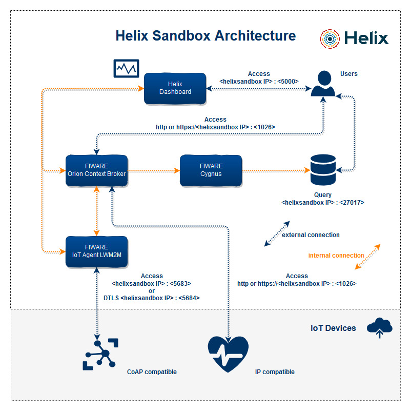
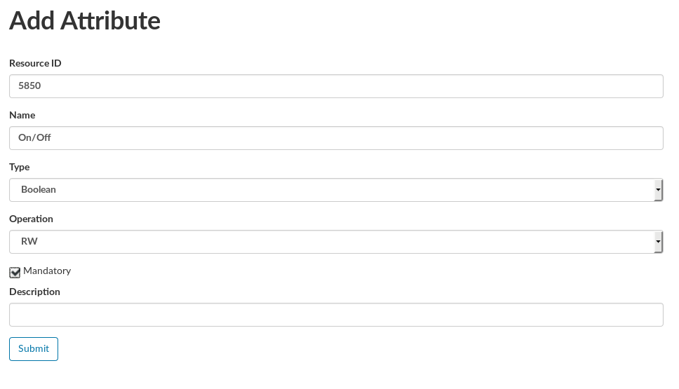
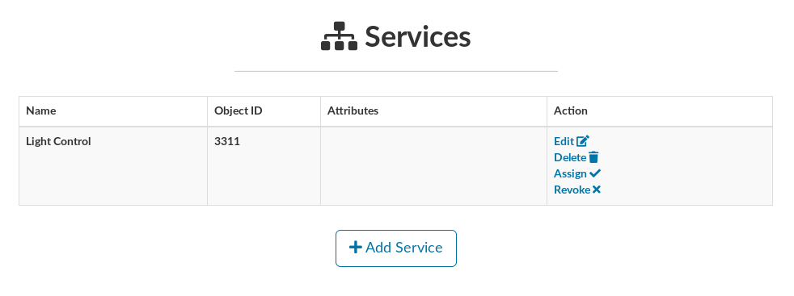
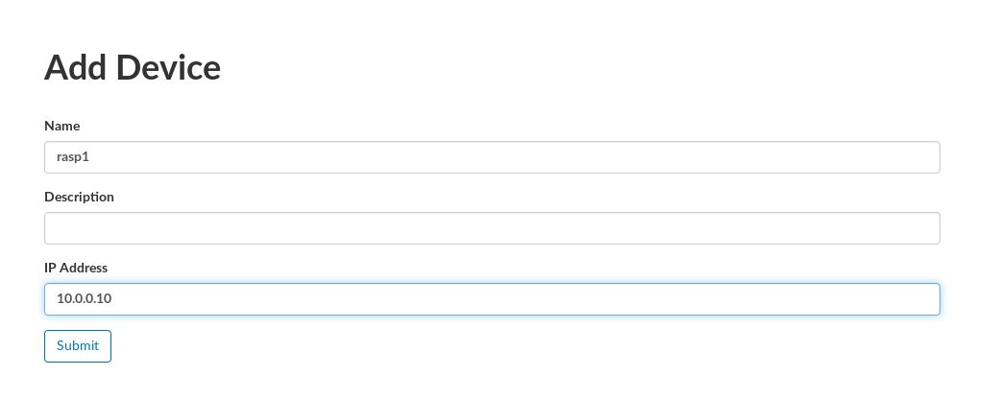
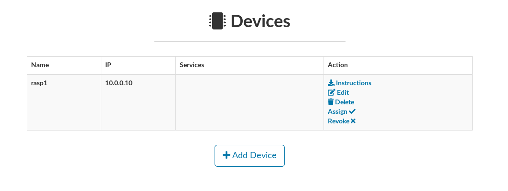
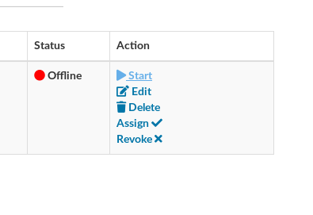
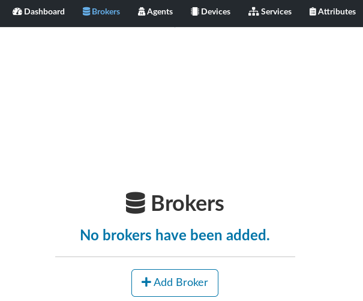
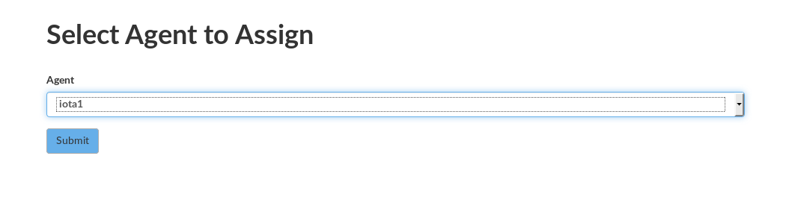
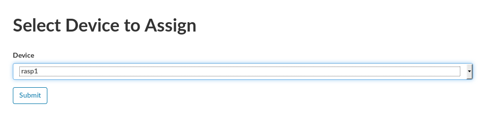
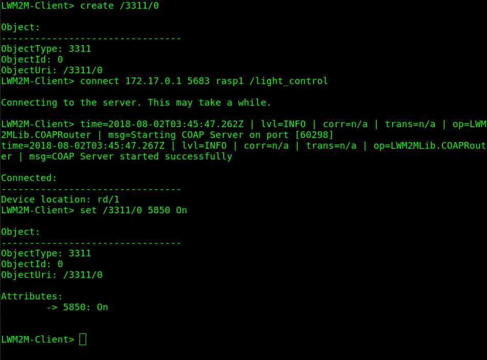

# Helix

<br>


<br>

## About

Helix Sandbox is an open platform that is fully compatible with FIWARE's Generic Enablers (GE). Its purpose is to simplify the process of installation, configuration and use of the GEs through an easy-to-use graphical interface that enables orchestration of the elements that constitute it. The platform is built on a microservice basis and uses Docker to perform the GE instantiation. Helix Sandbox can be installed on any Cloud platform or virtualization that enables the use of Linux virtual machines. In its internal architecture are present the Orion Context Broker, IoT Agent LWM2M Coap, Cygnus, Helix dashboard and a MongoDB database to provide the temporal storage of the data. It can be used to aid and accelerate the process of constructing PoCs (Proof of Concept) and experimental applications based on FIWARE with the use of few computional resources.

## Helix Sandbox Architecture



<br>

## Requirements

- We suggest using Ubuntu Server 16.04 LTS
- Install <b>Docker</b>: https://docs.docker.com/engine/installation/ and <b>docker-compose</b>: https://docs.docker.com/compose/install/.

- Download the template images to prevent first-time delays deploying containers using the web-interface

```
sudo docker pull mongo
sudo docker pull fiware/orion
sudo docker pull fiware/cygnus-ngsi
sudo docker pull m4n3dw0lf/dtls-lightweightm2m-iotagent
```

- If you want to use TLS/DTLS in the Orion and IoT Agents, you need to create a `/run/secrets` directory inside your host and populate with the certificate and key, you can generate a self-signed key-pair using the following command:

```
sudo mkdir -p /opt/secrets
sudo openssl req -x509 -nodes -days 365 -newkey rsa:2048 -keyout /opt/secrets/ssl_key -out /opt/secrets/ssl_crt
```

<br>

## Installing

> Replace the aes_key with your own password and ssl key-pair with your valid key-pair if you don't want to use a self-signed.

```
git clone https://github.com/m4n3dw0lf/helix-sandbox
cd helix-sandbox/compose
echo "change_to_your_encryption_key" > secrets/aes_key.txt
sudo docker-compose up -d
```

## Updating

```
cd helix-sandbox
git pull
cd compose
sudo docker-compose down
rm -rf ../helix/app/db/helix.sqlite
sudo docker-compose up -d
```

- Access: http://localhost:5000

- Setup the **admin** account

<br>

## DEMO Walkthrough

<br>

#### Creating an Attribute

- On the main interface, select **Attributes**


- Fill the attribute formulary, to follow the spec from IPSO, see:
  - https://github.com/IPSO-Alliance/pub



- Attribute created


<br>

#### Creating a Service

- On the main interface, select **Services**


- Fill the service formulary, to follow the spec from IPSO, see:
  - https://github.com/IPSO-Alliance/pub


- Service created



<br>

#### Creating a Device

- On the main interface, select **Devices**


- Fill the device formulary



- Device created



<br>

#### Creating an Agent

- On the main interface, select **Agents**


- Fill the agent formulary


- Agent registered


- Create the Agent container


- Start the Agent container



- Wait for a few moments and check the Agent status


#### Creating a Broker

- On the main interface, select **Brokers**



- Fill the broker formulary


- Broker registered


- Create the Broker container


- Start the Broker container


- Wait for a few moments and check the Broker status


<br>

#### Assign an Attribute to a Service

- On the main interface, select **Services** then on the service created previously, select **Assign** then select the On/Off attribute to the Light Control Service.


<br>

#### Assign a Service to a Device

- On the main interface, select **Devices** then on the device created previously, select **Assign** then select the Light Control Service.


<br>

#### Assign an Agent to a Broker

- On the main interface, select **Brokers** then on the broker created previously, select **Assign** then select the Agent.



<br>

#### Assign a Device to an Agent

- On the main interface, select **Agents** then on the agent created previously, select **Assign** then select the Device.



<br>

#### Connecting to the Agent using the device

Walkthrough client found here: https://github.com/telefonicaid/lwm2m-node-lib

Run the following commands in the client:

```
create /3311/0                                  # Notice: Object ID
connect <HELIX_IP> 5683 rasp1 /light_control      # Notice: Device and Service names
set /3311/0 5850 On                             # Notice: Resource ID
```



#### Query the device status on the FIWARE Orion Context Broker

Run the following curl:

```
curl -X POST -k https://<HELIX_IP>:1026/v1/queryContext \
--header "fiware-service:light_control" \
--header "fiware-servicepath:/light_control" \
--header "Content-Type:application/json" \
--header "Accept:application/json" \
-d '{
      "entities": [{
        "id" : "Device:rasp1"
      }]
    }'
```


#### Read the historical context thanks to FIWARE Cygnus capability

```
docker exec -it broker1_mongodb mongo
> show dbs
admin                0.000GB
local                0.000GB
orion                0.000GB
orion-light_control  0.000GB
sth_light_control    0.000GB
```

The `sth_light_control` will hold collections with the historical data record got from the IoT Agent.
