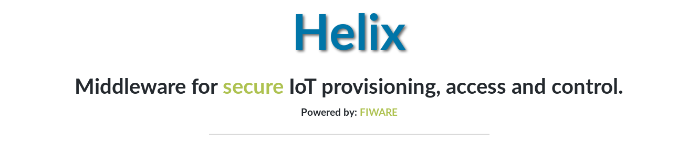

# Helix

<br>



<br>

## About

Middleware for secure IoT provisioning, access and control.

powered by: [Fiware](https://www.fiware.org/)

<br>

## Requirements

- Install <b>Docker</b>: https://docs.docker.com/engine/installation/ and <b>docker-compose</b>: https://docs.docker.com/compose/install/.

- Download the template images to prevent first-time delays deploying containers using the web-interface (Recommended)

```
sudo docker pull mongo
sudo docker pull fiware/orion
sudo docker pull m4n3dw0lf/dtls-lightweightm2m-iotagent
```

- If you want to use TLS/DTLS in the Orion and IoT Agents, you need to create a `/run/secrets` directory inside your host and populate with the certificate and key, you can generate a self-signed key-pair using the following command:

```
sudo mkdir /run/secrets
sudo openssl req -x509 -nodes -days 365 -newkey rsa:2048 -keyout /run/secrets/ssl_key -out /run/secrets/ssl_crt
```

<br>

## Installing

> Replace the aes_key with your own password and ssl key-pair with your valid key-pair if you don't want to use a self-signed. 

```
git clone https://github.com/m4n3dw0lf/helix-sandbox
cd compose
echo "change_to_your_encryption_key" > secrets/aes_key.txt
sudo docker-compose up -d
```

## Updating

```
cd helix-sandbox
git pull
cd compose
sudo docker-compose down
rm ../helix/app/db/helix.sqlite
sudo docker-compose up -d
```

- Access: http://localhost:5000

- Setup the **admin** account

<br>

## TO-DO

- On Setup, fetch the LWM2M IPSO Registry https://github.com/IPSO-Alliance/pub/blob/master/reg/README.md then populate the Attribute model with all the registries in the database, also remember to remove the attribute template/view, leave only the assign form and models.
