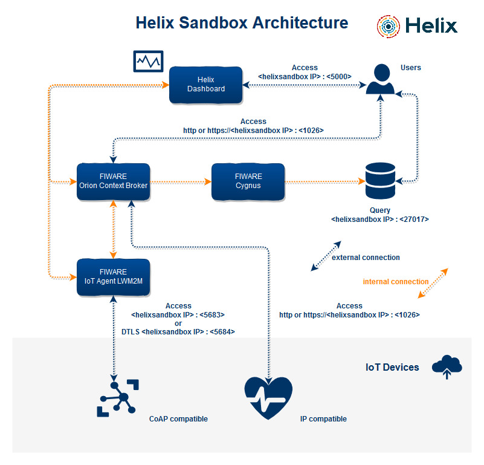

# Helix Sandbox

## About

Helix Sandbox is a Powered by FIWARE Platform that is fully compatible with FIWARE's Generic Enablers (GE). Its purpose is to simplify the process of installation, configuration and use of the GEs through an easy-to-use graphical interface that enables orchestration of the elements that constitute it. The platform is built on a microservice basis and uses Docker to perform the GE instantiation. Helix Sandbox can be installed on any Cloud or Virtualization Platform that enables the use of Linux virtual machines. In its internal architecture are present the Orion Context Broker, IoT Agent LWM2M CoAP DTLS, Cygnus, Helix dashboard and a MongoDB database to provide the temporal data storage. Helix Sandbox was designed for PoCs (Proofs of Concept), Startups MVPs (Minimal Viable Product), Students, Scientific Researches, and Experimental Applications based on FIWARE Technology using a few computational resources.

 
 

## Inside the Helix Sandbox

 

## How-to

  - Requirements, Installation and Maintenance
    - [Requirements](docs/requirements.md)
    - [Installation](docs/installation.md)
    - [Update/Reset](docs/update_reset.md)

  - Tutorials and How-to's
    - [Accessing Helix Sandbox Web Interface](docs/accessing.md)
    - [Creating an Attribute - CoAP only](docs/create_attribute.md)
    - [Creating a Service - CoAP only](docs/create_service.md)
    - [Creating a Device - CoAP only](docs/create_device.md)
    - [Creating an Agent - CoAP only](docs/create_agent.md)
    - [Creating a Broker - IP compatible IoT device or CoAP](docs/create_broker.md)
    - [Assigning an Attribute to a Service - CoAP only](docs/assign_attribute.md)
    - [Assigning a Service to a Device CoAP only](docs/assign_service.md)
    - [Assigning an Agent to a Broker - CoAP only](docs/assig_agent.md)
    - [Assigning a Device to an Agent - CoAP only](docs/assign_device.md)
    - [Connecting to the Agent using the Device - CoAP only](docs/connecting_device.md)
    - [FIWARE Cygnus - Example of historical storage using MongoDB](docs/cygnus_historical_storage.md)
    - [Creating a third-party dashboard](docs/creating_dashboard.md)

  > If this is the first time you use Helix Sandbox, we recommend that you proceed in the order above.
  
  > The CORS (Cross-Origin Resource Sharing) support has been disabled in Mars 0.0.2 release. 
 

## Additional Resources

#### FIWARE Market Place
http://marketplace.fiware.org/pages/platforms

#### FIWARE Orion Context Broker
https://fiware-orion.readthedocs.io/en/master/index.html

#### FIWARE Cygnus
https://fiware-cygnus.readthedocs.io/en/latest/

#### IoT Agent CoAP with DTLS - Secure FIWARE
https://github.com/m4n3dw0lf/SecureFiware

#### Postman Collection - Orion Context Broker
https://goo.gl/dPPHQv

#### Temperature Sensor - send data to Helix Sandbox from Arduino - code
https://goo.gl/nX8iMG

#### Temperature Sensor - send data to Helix Sandbox from Arduino - electrical schema
https://goo.gl/TxBwJa

#### © Helix Platform 2019, All rights reserved.
