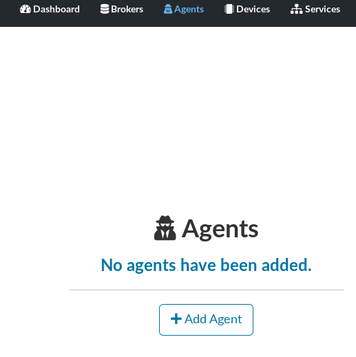
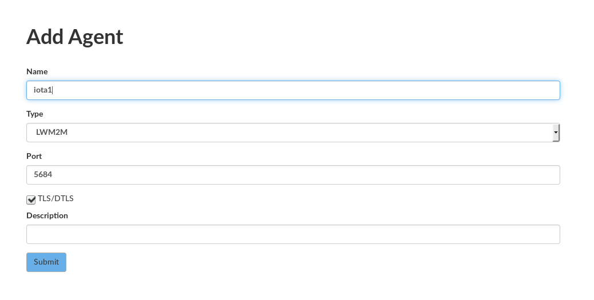
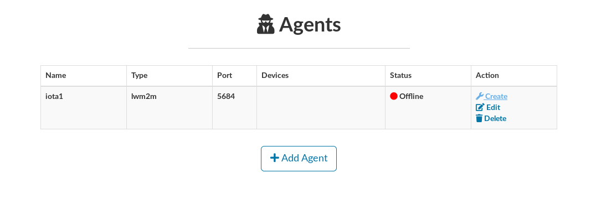
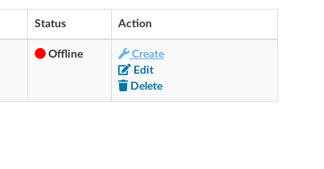

## Creating an Agent

- On the main interface, select **Agents**

- Fill the agent formulary

- Agent registered

- Create the Agent container

- Start the Agent container

- Wait for a few moments (or keep refreshing the browser) and check the Agent status

