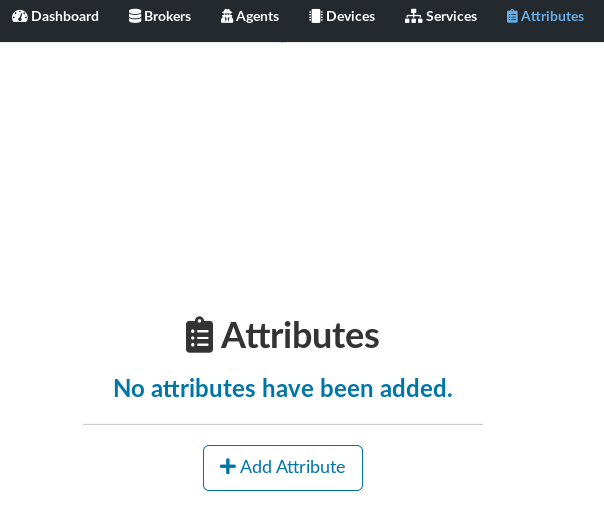
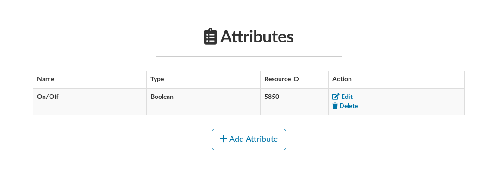

## Creating an Attribute

- On the main interface, select **Attributes**

- Fill the attribute formulary, to follow the spec from IPSO, see:
  - https://github.com/IPSO-Alliance/pub
  - http://www.openmobilealliance.org/wp/OMNA/LwM2M/LwM2MRegistry.html

- Attribute created

 

