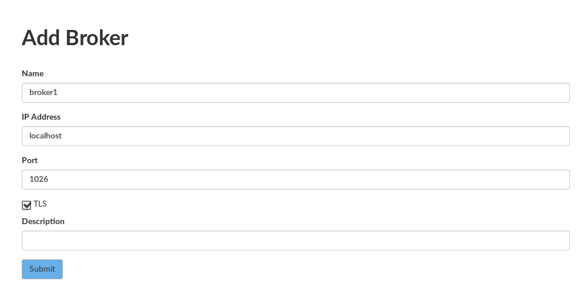
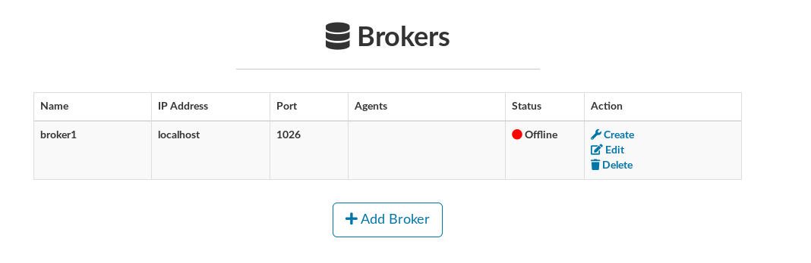

## Creating a Broker

- On the main interface, select **Brokers**

- Fill the broker formulary

> The check-box TLS is optional

- Broker registered

- Create the Broker container

- Start the Broker container

- Wait for a few moments (or keep refreshing the browser) and check the Broker status

> You can try if your context broker is working properly typing http or https://<helix_ip>:1026/version in your web browser.
