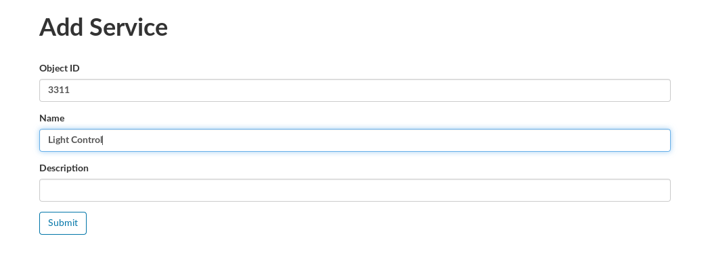

## Creating a Service

- On the main interface, select **Services**

- Fill the service formulary, to follow the spec from IPSO, see:
  - https://github.com/IPSO-Alliance/pub and http://www.openmobilealliance.org/wp/OMNA/LwM2M/LwM2MRegistry.html

- Service created

